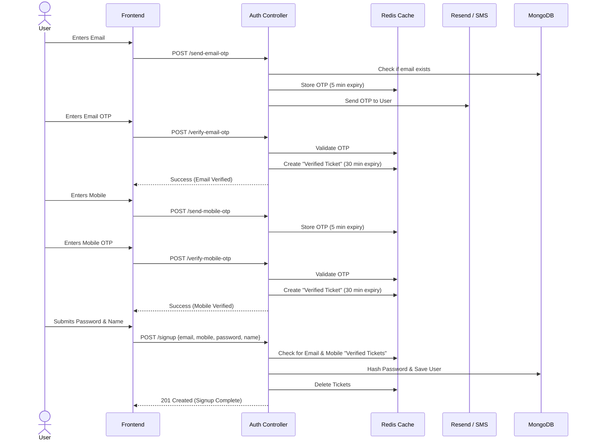
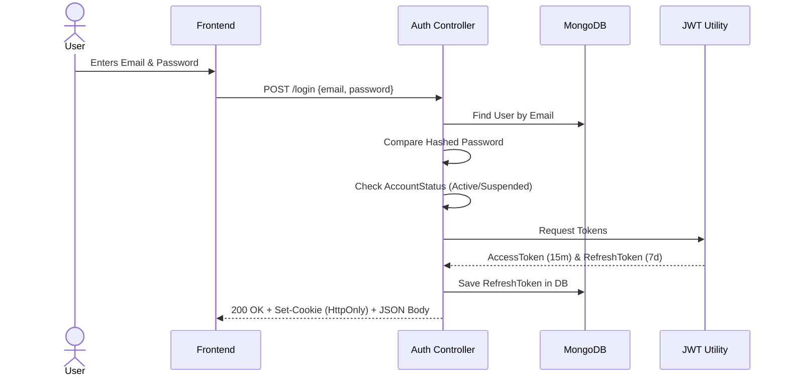
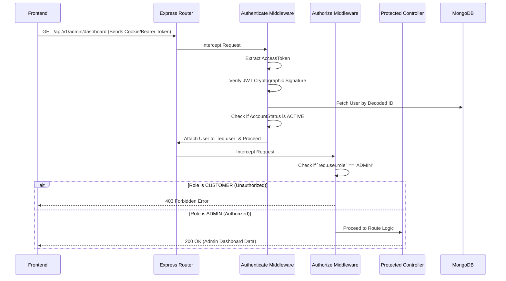

# Authentication & Authorization Architecture

Below are the detailed flows for how authentication (verifying who a user is) and authorization (verifying what a user is allowed to do) work in the Ghatkaari Backend.

## 1. Pre-Signup Verification Flow
This flow ensures that no junk data enters the database. Users must verify their contact details via Redis before the actual MongoDB `User` document is created.

## 2. Login & Token Generation Flow
This flow handles generating the JWTs and setting the highly secure `HttpOnly` cookies.

## 3. Authorization Flow (Accessing Protected Routes)
This flow demonstrates how the middlewares intercept requests to verify identity and check permissions.

