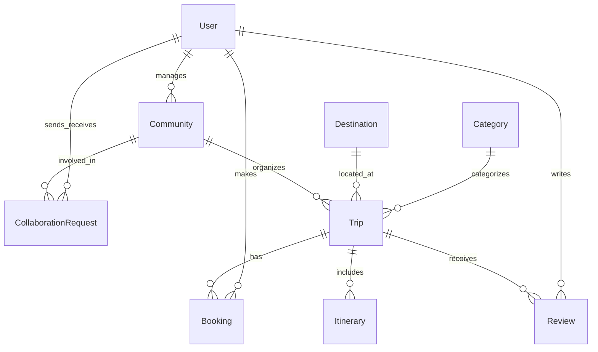

# Ghatkaari Project Documentation

## 1. Project Overview
Ghatkaari is a premium, fully responsive Travel Marketplace Platform. It facilitates a seamless, visually stunning experience for customers to explore, search, and book travel experiences. The platform also enables community organizers to manage and list their trips, while administrators oversee the entire marketplace.

## 2. System Architecture
- **Frontend:** Next.js 16, React 19, Tailwind CSS v4
- **Backend:** Node.js, Express.js
- **Database:** MongoDB
- **Architecture Pattern:** Feature-based modular architecture (Controllers, Services, Models, Routes)

## 3. Tech Stack
- **Backend:** Node.js, Express.js, TypeScript, Mongoose
- **Validation:** Zod
- **Security:** Helmet, CORS, Express Rate Limit
- **Logging:** Morgan

## 4. Database Design

### Overview
The database uses MongoDB. Below is the relational representation of our document structures.

### Collections / Entities

#### 1. User
**Purpose:** Stores all user accounts (Admins, Customers, Community Organizers).
**Fields:**
| Field | Type | Required | Unique | Description |
|---|---|---|---|---|
| `_id` | ObjectId | Yes | Yes | Primary Key |
| `name` | String | Yes | No | Full name of the user |
| `email` | String | Yes | Yes | User email address |
| `password` | String | Yes | No | Hashed password |
| `role` | Enum | Yes | No | `ADMIN`, `CUSTOMER`, `COMMUNITY` |
| `phone` | String | No | No | Contact number |
| `avatar` | String | No | No | URL to profile picture |
| `createdAt` | Date | Yes | No | Timestamp |
| `updatedAt` | Date | Yes | No | Timestamp |

**Indexes:** `{ email: 1 }` (Unique)

#### 2. Community
**Purpose:** Profile for community organizers who create and manage trips.
**Fields:**
| Field | Type | Required | Unique | Description |
|---|---|---|---|---|
| `_id` | ObjectId | Yes | Yes | Primary Key |
| `userId` | ObjectId | Yes | Yes | Ref to User (Organizer) |
| `communityName` | String | Yes | Yes | Name of the community |
| `description` | String | Yes | No | About the community |
| `city` | String | Yes | No | Base city |
| `state` | String | Yes | No | Base state |
| `logo` | String | No | No | Community logo URL |
| `isVerified` | Boolean | Yes | No | Default: false (Admin approval) |
| `createdAt` | Date | Yes | No | Timestamp |

**Indexes:** `{ communityName: 1 }` (Unique), `{ userId: 1 }` (Unique)
**Relationships:** 1:1 with `User`

#### 3. Category
**Purpose:** Categorizes trips (e.g., Trekking, Camping, Backpacking).
**Fields:**
| Field | Type | Required | Unique | Description |
|---|---|---|---|---|
| `_id` | ObjectId | Yes | Yes | Primary Key |
| `name` | String | Yes | Yes | Category name |
| `image` | String | No | No | Category image URL |

#### 4. Destination
**Purpose:** Represents specific geographic locations for trips.
**Fields:**
| Field | Type | Required | Unique | Description |
|---|---|---|---|---|
| `_id` | ObjectId | Yes | Yes | Primary Key |
| `name` | String | Yes | Yes | Name of destination (e.g., Kalsubai) |
| `state` | String | Yes | No | State |
| `description`| String | No | No | About the destination |

#### 5. Trip (Package)
**Purpose:** The core entity representing a travel package.
**Fields:**
| Field | Type | Required | Unique | Description |
|---|---|---|---|---|
| `_id` | ObjectId | Yes | Yes | Primary Key |
| `communityId` | ObjectId | Yes | No | Ref to Community |
| `title` | String | Yes | No | Trip title |
| `slug` | String | Yes | Yes | URL-friendly title |
| `destinationId`| ObjectId | Yes | No | Ref to Destination |
| `categoryId` | ObjectId | Yes | No | Ref to Category |
| `description` | String | Yes | No | Detailed description |
| `price` | Number | Yes | No | Base price |
| `startDate` | Date | Yes | No | Departure date |
| `endDate` | Date | Yes | No | Return date |
| `totalSeats` | Number | Yes | No | Total available capacity |
| `bookedSeats` | Number | Yes | No | Default: 0 |
| `images` | [String] | Yes | No | Array of image URLs |
| `status` | Enum | Yes | No | `DRAFT`, `PUBLISHED`, `COMPLETED`, `CANCELLED` |

**Relationships:** N:1 with `Community`, `Destination`, `Category`
**Indexes:** `{ slug: 1 }` (Unique), `{ communityId: 1 }`, `{ destinationId: 1 }`

#### 6. Itinerary (Embedded in Trip or Separate Collection)
*Note: For MongoDB, embedding an array of days within the Trip document is often optimal unless itineraries are massive.*
**Purpose:** Day-by-day plan for a Trip.
**Fields (Schema):**
| Field | Type | Required | Unique | Description |
|---|---|---|---|---|
| `dayNumber` | Number | Yes | No | e.g., Day 1 |
| `title` | String | Yes | No | e.g., Arrival and Briefing |
| `activities` | [String] | Yes | No | List of activities |
| `meals` | [String] | No | No | Included meals |

#### 7. Booking
**Purpose:** Records a customer's reservation for a trip.
**Fields:**
| Field | Type | Required | Unique | Description |
|---|---|---|---|---|
| `_id` | ObjectId | Yes | Yes | Primary Key |
| `tripId` | ObjectId | Yes | No | Ref to Trip |
| `customerId` | ObjectId | Yes | No | Ref to User |
| `bookingDate` | Date | Yes | No | Default: Date.now() |
| `passengers` | Number | Yes | No | Number of seats booked |
| `totalAmount` | Number | Yes | No | Total cost |
| `paymentStatus`| Enum | Yes | No | `PENDING`, `COMPLETED`, `FAILED` |
| `bookingStatus`| Enum | Yes | No | `CONFIRMED`, `CANCELLED` |

**Relationships:** N:1 with `Trip` and `User`

#### 8. Review
**Purpose:** Customer feedback on a completed trip.
**Fields:**
| Field | Type | Required | Unique | Description |
|---|---|---|---|---|
| `_id` | ObjectId | Yes | Yes | Primary Key |
| `tripId` | ObjectId | Yes | No | Ref to Trip |
| `customerId` | ObjectId | Yes | No | Ref to User |
| `rating` | Number | Yes | No | 1 to 5 |
| `comment` | String | No | No | Text review |
| `createdAt` | Date | Yes | No | Timestamp |

**Constraints:** A user can only leave one review per booked trip.

#### 9. Collaboration Request
**Purpose:** Workflow for communities/organizers to collaborate or contact admins/each other.
**Fields:**
| Field | Type | Required | Unique | Description |
|---|---|---|---|---|
| `_id` | ObjectId | Yes | Yes | Primary Key |
| `senderId` | ObjectId | Yes | No | Ref to User/Community |
| `receiverId` | ObjectId | Yes | No | Ref to Admin/Community |
| `status` | Enum | Yes | No | `PENDING`, `ACCEPTED`, `REJECTED` |
| `message` | String | Yes | No | Request details |

## 5. Authentication & Authorization
*(To be detailed post-schema approval)*

## 6. Backend Flow
*(To be detailed post-schema approval)*

## 7. API Documentation
*(To be detailed post-schema approval)*

## 8. Admin Module
*(To be detailed post-schema approval)*

## 9. Customer Module
*(To be detailed post-schema approval)*

## 10. Community Module
*(To be detailed post-schema approval)*

## 11. Third-Party Integrations
*(To be detailed post-schema approval)*

## 12. Deployment Guide
*(To be detailed post-schema approval)*

## 13. Environment Variables
*(To be detailed post-schema approval)*

## 14. Folder Structure
*(To be detailed post-schema approval)*

## 15. Future Enhancements
*(To be detailed post-schema approval)*

## 16. Changelog

### v1.0.0
- Initial database schema designed and documented.
